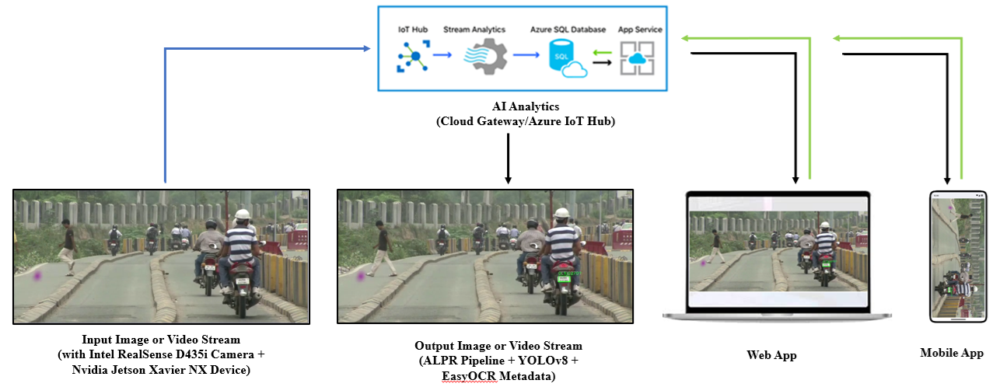

## AzureALPR: An AI-Powered Automatic License Plate Recognition System with an Azure IoT Hub Interface for Vehicle Identification and Tracking

Abstract—Automatic license plate detection and recognition systems are crucial in modern intelligent transportation systems, including traffic control, toll collection, and parking management. This paper presents a real-time, AI-driven, Azure IoT-based automatic license plate recognition system tailored for Indian traffic environments. The system utilizes an Intel RealSense D435i depth camera paired with an Nvidia Jetson Xavier NX to capture vehicle images and extract license plate numbers using a lightweight deep learning pipeline: YOLOv8 for detection and EasyOCR for robust optical character recognition. The recognized license plate text is enriched with location and timestamp metadata and transmitted to the cloud through the Azure IoT Edge runtime. At the cloud level, the Azure IoT Hub enables seamless ingestion and routing of telemetry data to various services, including Azure Stream Analytics, SQL Database, and App Services. This infrastructure supports AI-based analytics, real-time alerting, and long-term data storage. A Web and mobile application interface - powered by Azure APIs and Power BI dashboards - allows traffic authorities to visualize vehicle data, monitor violations, and receive alerts for blocked or duplicated plates. The system achieves a detection accuracy of 95.4\% and an OCR precision of 92.3% while maintaining an average throughput of 15 FPS. This scalable, low-latency automatic license plate recognition system offers an effective solution for intelligent traffic management and law enforcement in smart city applications. The proposed system offers a scalable and adaptable solution for automated license plate recognition in various applications.

## Citation:
To be filled.
